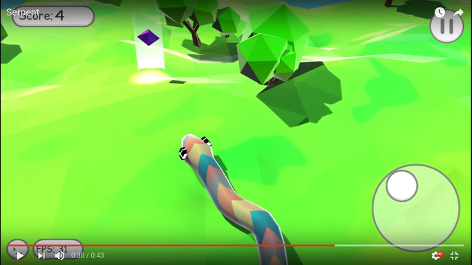

 The Own of this project is *Serpent*
 original link: https://github.com/ip/serpent
 What is this task for?

This is unfinished remake of classical Snake arcade using Unity. It may provide a base for your game.

Watch original video before changes:

It wasn't planned for external use. There is a lot of garbage, some notes are in Russian (although all code comments are English)

You can use arbitrary mesh as a surface for snake. 

 How do I get set up? 

Clone the project and import root folder as Unity project.

There are some diagrams in `/Doc/*.uxf`. Use [UMLet](http://www.umlet.com/) to view them.

*The major changes that I've implemented:
1-Collision detection with snake body isn't implemented,but we provide Body collisions pseudocode

    void Update() {
        // Must be called after each grow
        foreach (otherSnake in snakes)
            if (otherSnake.CheckCollisionWith(this.collider)) {
                gameOverSnake();
                break;
            }
    }
2- Collision with board 
3- Collision with obstacles. Obstacles in this game are designed as trees in game
4- view gameOver Text when collision detected in game and pause game.

